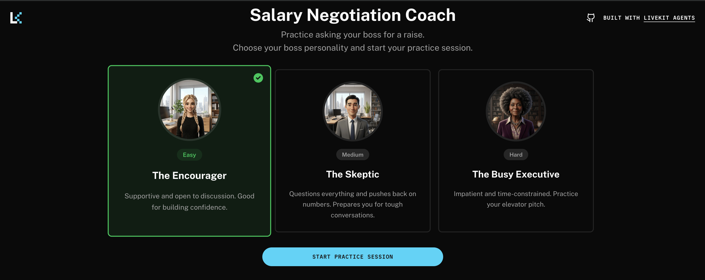

# LemonSlice Salary Negotiation Coach

A LiveKit Agents demo that helps you practice asking your boss for a raise through interactive role-play sessions. Uses the lemonslice plugin to create an AI-powered coaching experience with different boss personalities and real-time feedback.



## Features

- **Three boss personalities**: Practice with Easy, Medium, and Hard difficulty levels
- **Real-time coaching**: Get feedback and advice during your practice session
- **Smart mode switching**: Seamlessly transition between role-play and coaching modes
- **Session timer**: 3-minute practice sessions with automatic wrap-up
- **Contextual feedback**: Click "How am I doing?" to get coaching advice during your session
- **Voice interaction**: Natural conversation using ElevenLabs STT `scribe_v2` (English), Mistral `mistral-medium-latest`, and ElevenLabs TTS `eleven_turbo_v2_5` (English)
- **Visual avatar**: Powered by lemonslice for procedural visual generation

## Prerequisites

- Python 3.10+
- Node.js 18+
- LiveKit account
- LemonSlice API key
- API keys for:
  - LiveKit
  - LemonSlice
  - Mistral
  - ElevenLabs

## Installation

1. Clone this repository
   ```bash
   git clone <repository-url>
   cd lemonslice
   ```

2. Install backend dependencies
   ```bash
   cd agent
   uv sync
   ```

3. Install frontend dependencies
   ```bash
   cd frontend
   pnpm install
   ```

4. Copy the `.env.example` file to `.env.local` in the `agent` directory and fill in your API keys
   ```bash
   cd agent
   cp .env.example .env.local
   ```

## Configuration

Set the following environment variables in your `.env.local` file:

```bash
# LiveKit Configuration
LIVEKIT_API_KEY=your_livekit_api_key
LIVEKIT_API_SECRET=your_livekit_api_secret
LIVEKIT_URL=wss://your-project.livekit.cloud

# LemonSlice Configuration
LEMONSLICE_API_KEY=your_lemonslice_api_key

# BYO AI Providers
MISTRAL_API_KEY=your_mistral_api_key
ELEVEN_API_KEY=your_eleven_api_key
```

ElevenLabs key requirements:
- Required for runtime: STT + TTS permissions.
- Optional: `user_read` permission is not required for this project runtime path.

## Usage

### Backend setup

Run the agent with:

```bash
cd agent
uv run lemonslice-agent.py dev
```

The agent will start and connect to your LiveKit server.

### Frontend setup

1. Navigate to the frontend directory:
   ```bash
   cd frontend
   ```

2. Start the development server:
   ```bash
   pnpm dev
   ```

3. Open your browser and navigate to:
   ```
   http://localhost:3000
   ```

4. Select a boss personality and start practicing

## Boss personalities

The agent includes three distinct boss types to practice with:

### The Encourager (Easy)
- Supportive and open to discussion
- Responds positively to clear value demonstrations
- Good for building confidence and learning the basics

### The Skeptic (Medium)
- Questions your reasoning and assumptions
- Challenges you to defend your worth
- Pushes back on numbers and justifications
- Good for preparing difficult conversations

### The Busy Executive (Hard)
- Impatient and time-constrained
- Values conciseness and directness
- Needs quick, compelling arguments
- Good for practicing elevator pitch style requests

## How it works

### Session flow

1. **Select a boss**: Choose your difficulty level from the welcome screen
2. **Role-play mode**: The AI boss engages in a salary negotiation conversation
3. **Coaching mode**: Click "How am I doing?" to pause and get feedback from the coach
4. **Return to practice**: The coach will guide you back to continue the conversation
5. **Wrap-up**: After 3 minutes, the session automatically ends

### Coaching features

During coaching mode, the agent provides specific feedback on your negotiation approach, including what's working well and areas to improve. The coaching is contextual based on the conversation so far.

## Project structure

```
lemonslice/
├── agent/
│   ├── lemonslice-agent.py    # Main agent logic
│   ├── utils.py                # Prompt loading utilities
│   ├── prompts/                # Boss and coaching prompts
│   └── pyproject.toml          # Python dependencies
└── frontend/
    ├── components/
    │   └── app/                # React components
    ├── lib/
    │   └── boss-personalities.ts  # Boss configuration
    └── app/                    # Next.js app router
```

## Extending

To modify the boss personalities:

1. Edit the prompt files in `agent/prompts/`:
   - `easy_boss_prompt.yaml`
   - `medium_boss_prompt.yaml`
   - `hard_boss_prompt.yaml`

2. Update the boss configurations in `frontend/lib/boss-personalities.ts`

To customize the coaching strategy:

1. Modify the coaching instructions in the prompt YAML files
2. Adjust the `how_am_i_doing()` function tool logic in `agent/lemonslice-agent.py`

## Built with

- [LiveKit Agents](https://docs.livekit.io/agents/) - Agent framework
- [LemonSlice Plugin](https://docs.livekit.io/agents/plugins/lemonslice/) - Avatar generation
